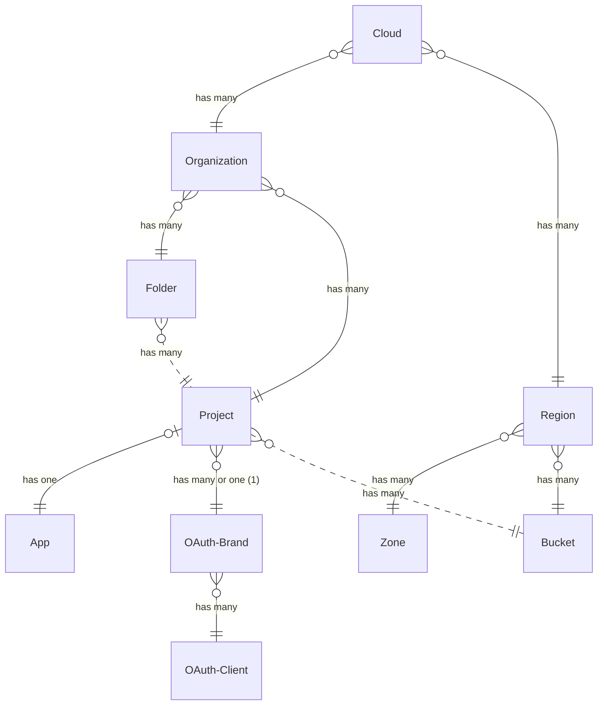

## Notes
(1): It is currently possible to create multiple brands via the web interface, but only one via the command line.

## Open questions:
* Is a Bucket _identified_ by Region or Project? (Currently modeled as Region).

> Written with [StackEdit](https://stackedit.io/).
<!--stackedit_data:
eyJoaXN0b3J5IjpbMTIwNzI0MDc1OF19
-->